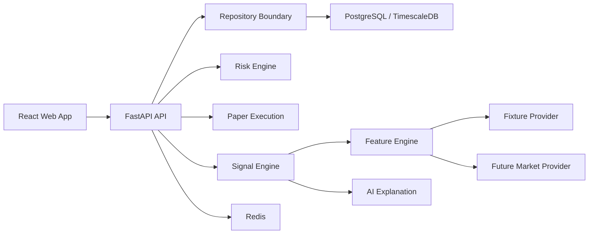

# Architecture

## System Diagram

## Service Responsibilities

- Market ingestion normalizes exchange data and rejects invalid messages.
- Feature engine calculates deterministic feature snapshots.
- Signal engine produces versioned strategy scores and signal status.
- Risk engine applies mandatory blocks before any opportunity is actionable.
- Paper execution simulates fills, fees, slippage, stops, and targets.
- AI explanation renders structured evidence into plain language.
- Persistence stores signals, data-health state, paper trading state, journal entries, and performance snapshots behind repository contracts.

## Data Flow

Fixture or market events become typed trades, candles, and order-book snapshots. Fixture mode replays timestamped events through the same local order-book engine expected for live providers. Feature snapshots are calculated from these inputs. Strategies generate candidate signals. Risk and manipulation controls can block candidates. Approved or blocked signals are stored with component contributions and explanations.

## Failure Handling

Missing data, stale feeds, invalid order books, or checksum failures suspend signal calculation. The UI must surface suspended states instead of substituting fake values.

## Persistence

The current persistence boundary is `QuanTradeRepository`. The API service layer writes signals, data-health state, paper orders, portfolio snapshots, journal entries, and performance summaries through this contract.

Current implementation:

- `InMemoryQuanTradeRepository` for deterministic fixture/test mode
- `SqlAlchemyQuanTradeRepository` for database-backed operation after dependency installation
- SQL schema in `infrastructure/migrations/0001_initial_schema.sql`
- SQLAlchemy models in `apps/api/quantrade_api/persistence/models.py`
- Alembic config in `infrastructure/migrations/alembic.ini`

Next implementation step: run migrations against Postgres and switch the API dependency wiring from in-memory repository to session-backed repository in non-test modes.

## Current API Surface

- `GET /api/v1/health`
- `GET /api/v1/system/status`
- `GET /api/v1/scanner/signals`
- `GET /api/v1/signals/{signal_id}`
- `GET /api/v1/fixture/replay`
- `GET /api/v1/assets/{symbol}/order-book`
- `GET /api/v1/data-health`
- `POST /api/v1/paper/orders`
- `GET /api/v1/paper/positions`
- `GET /api/v1/portfolio`
- `GET /api/v1/journal`
- `GET /api/v1/performance`
